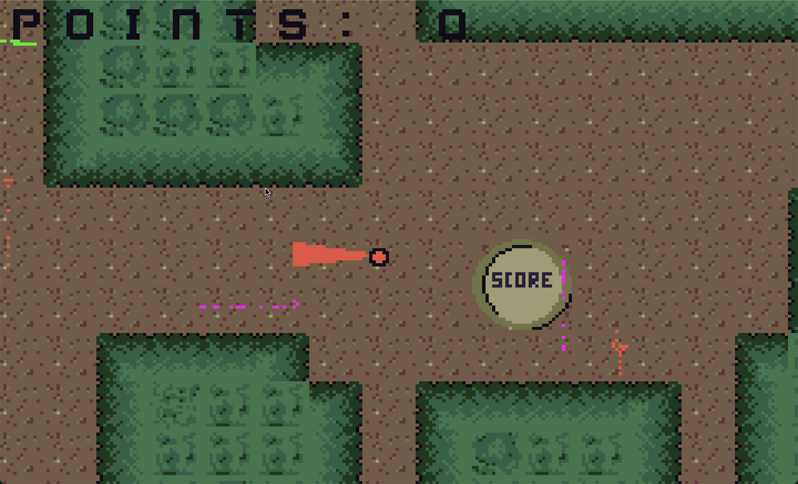

# Lampy

A simple multiplayer game for the Firefly Zero handheld retro gaming console.

Race to be the first to collect 10 fireflies using matching colored
flashlights.

## Controls

- Steer with the touchpad, the left joystick on controller while holding down left shoulder button, o r arrow keys on keyboard.
- Use buttons to activate different colored flashlights.
- Trap fireflies in the flashlight matching their color and bring them to the collection point in the center of the play area.
- First player to collect 10 fireflies wins.

## License

Released under the MIT License.
